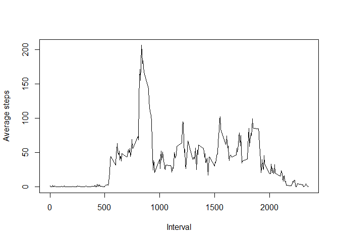
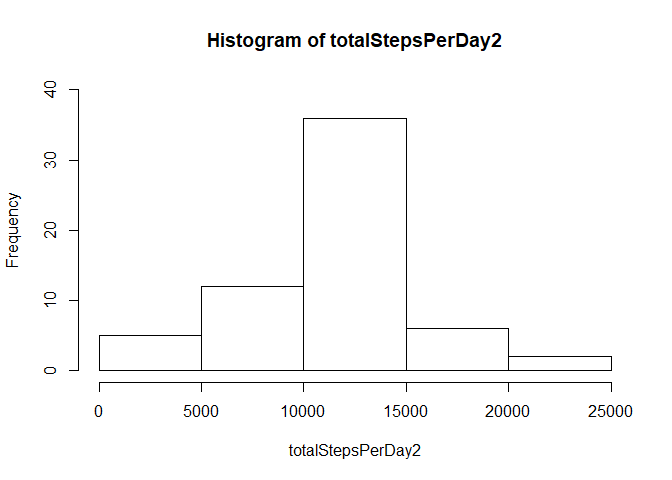

## Loading and preprocessing the data

In order to make it easier to work with dates, lubridate package is used.


```r
library(lubridate)
```

```
## 
## Attaching package: 'lubridate'
```

```
## The following object is masked from 'package:base':
## 
##     date
```

```r
data <- read.csv("activity.csv")
data$date <- ymd(data$date)
```

## What is mean total number of steps taken per day?


```r
totalStepsPerDay <- with(data,tapply(steps, date,sum , na.rm = TRUE))
hist(totalStepsPerDay,ylim=c(0,40))
```

<!-- -->

```r
meanStepsPerDay <- mean(totalStepsPerDay)
medianStepsPerDay <- median(totalStepsPerDay)
meanStepsPerDay
```

```
## [1] 9354.23
```

```r
medianStepsPerDay
```

```
## [1] 10395
```

Based on the provided data, the average number of steps per day is 9354.2295082.


## What is the average daily activity pattern?

As one would expect there is no activity between midnight and morning. Then the number of steps increases with a peak around midday. During afternoon till night there are random activities with random local peaks. The steps decreases as we get close to midnight.


```r
meanStepsPerInterval <- with(data,tapply(steps, interval,mean , na.rm = TRUE))
plot(as.numeric(names(meanStepsPerInterval)),meanStepsPerInterval,type="l",xlab="Interval",ylab="Average steps")
```

<!-- -->

```r
maxInterval <- as.numeric(names(which.max(meanStepsPerInterval)))
print(maxInterval)
```

```
## [1] 835
```

## Imputing missing values

The missing steps are replaced by average number of steps for that interval. This method is used in order to lower the chance of having any NA in the new dataset. 


```r
TotalNAs <- sum(is.na(data$steps))
dataFilled <- data
for (i in 1:nrow(dataFilled))
{
  if(is.na(dataFilled$steps[i]))
  {
    dataFilled$steps[i] <- meanStepsPerInterval[as.character(dataFilled$interval[i])]
  }
}
```

After replacing the NAs, the distribution and average values are changed. More specifically, the number of days with steps between 10-15K has increased as a result of filling the missing values and number of days with steps between 0 to 5K has decreased.


```r
totalStepsPerDay2 <- with(dataFilled,tapply(steps, date,sum , na.rm = TRUE))
hist(totalStepsPerDay2,ylim=c(0,40))
```

<!-- -->

```r
meanStepsPerDay2 <- mean(totalStepsPerDay2)
medianStepsPerDay2 <- median(totalStepsPerDay2)
print(paste0("Average of steps per day after filling the NAs =",meanStepsPerDay2))
```

```
## [1] "Average of steps per day after filling the NAs =10766.1886792453"
```

```r
print(paste0("Median of steps per day after filling the NAs =", medianStepsPerDay2))
```

```
## [1] "Median of steps per day after filling the NAs =10766.1886792453"
```

## Are there differences in activity patterns between weekdays and weekends?
Looking at the below graphs, there is a clear difference between weekdays and weekend activities, e.g. start of activities, peak values, daily distribution of activities and so on.


```r
dataFilled["days"] <- factor(sapply(weekdays(dataFilled$date),function(x){if(x=="Sonntag" || x=="Samstag") {"Weekend"} else {"Weekdays"}}))

weekdaysData <- subset(dataFilled,dataFilled$days=="Weekdays")
weekendData <- subset(dataFilled,dataFilled$days=="Weekend")
weekdaysMean <- with(weekdaysData,tapply(steps, interval,mean , na.rm = TRUE))
weekendMean <- with(weekendData,tapply(steps, interval,mean , na.rm = TRUE))
mean(weekdaysMean)
```

```
## [1] 35.61058
```

```r
mean(weekendMean)
```

```
## [1] 42.3664
```

```r
par(mfrow = c(2, 1))
plot(as.numeric(names(weekdaysMean)),weekdaysMean,type="l",xlab="Interval",ylab="Average steps", main="Weekdays",ylim = c(0,250),xlim = c(0,2500))
plot(as.numeric(names(weekendMean)),weekendMean,type="l",xlab="Interval",ylab="Average steps", main="Weekends",ylim = c(0,250),xlim = c(0,2500))
```

<!-- -->
